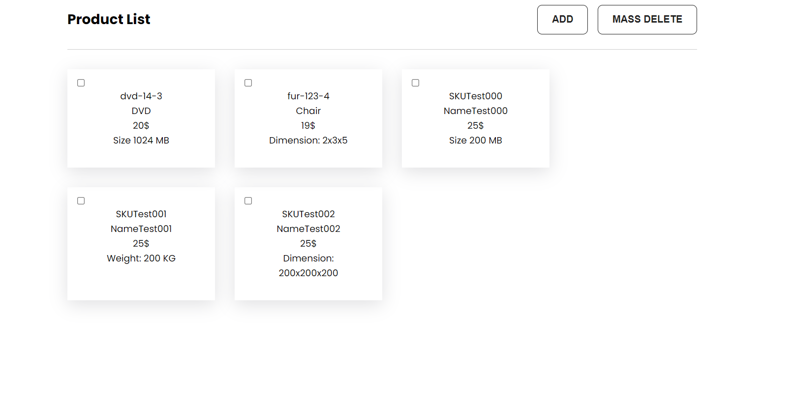

# Time Tracker App for Mobile

This is an ecommerce website where people can add products, delete products.

## Live Preview

## Technologies

- React JS - [Link](https://reactjs.org/)
- React Router Dom - [Link](https://reactrouter.com/en/main)
- PHP - [Link](https://www.php.net/)
- MySQL - [Link](https://www.mysql.com/)

## Features

- user can see products
- user can add products
- user can mass delete products

## What I learned

- I learned React JS functional component
- I learned PHP
- I learned to work with MySQL
- I learned To work with API

## Author

- Sajib Hossain - [twitter](https://twitter.com/sajib_hsn)
- Sajib Hossain - [Linked in](https://www.linkedin.com/in/sajib-hossain-17929b225/)
